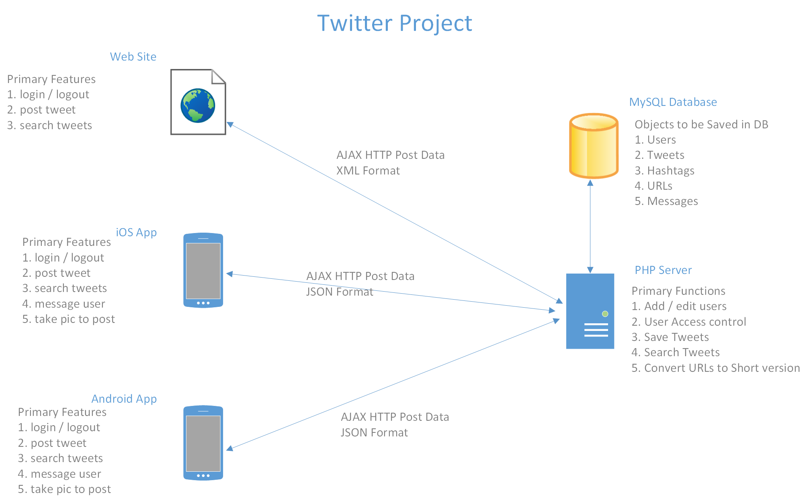

# High Level Architecture

While every project is different and unique, they all have things in common. Each of the projects has client parts and server parts. Data needs to be stored inside an app and/or in databases or text files on the client or on the server. Server-side code can talk with a database as well as the client-side components. Data passing between servers and client needs to be passed as url encoded values from a form, as XML, as a websocket connection and stream, or as JSON data.

The high-level architecture document is a diagram that indicates which components you intend to build, the format for data being passed between them, and the primary features | functions | capabilities of each component. It can include parts that will be part of the eventual finished version of the solution too, not just the features you are building in the first few sprints.

Here is an example diagram for a simplified version of Twitter that has a website, an iOS app, and an Android app.

You can submit your diagram as a `.png`, `.pdf`, or `.docx`.