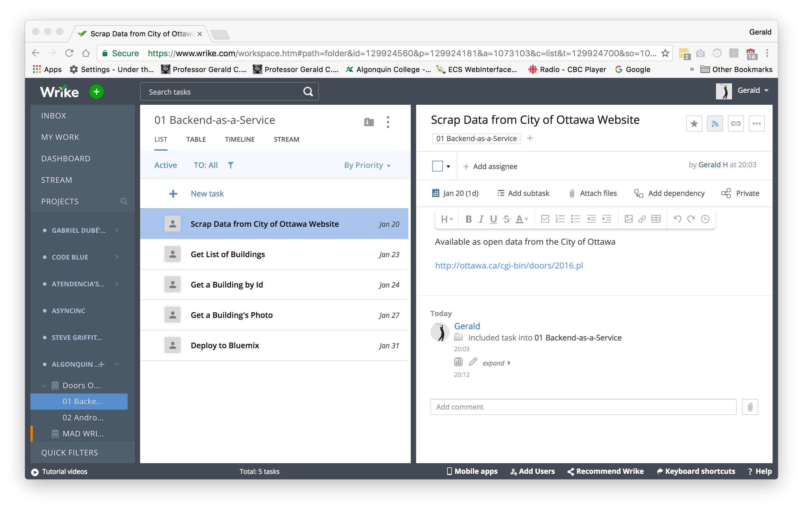

# Project Management Basics with Wrike

Wrike is an online tool that "helps you organize and track your work, collaborate with others, and report on what's been done." [1]

## Create Your Wrike Account

//TODO: all project students

You will be getting an invite to join the projects on Wrike.

Please accept this invitation and finish your registration as required.

## Basic Structures of Wrike

The basic building blocks of Wrike are: Projects, Folders, and Tasks.

The idea is to create projects, add folders to projects, and add tasks to folders, all of which are shareable with other Wrike members, such as your project team and course profs. Your Instructor will be creating the base projects and inviting your team members. You will not need to create the project for your team.

At the bottom of your screen on Wrike.com you will see a link for video tutorials. There are four introductory video links along the bottom of the screen. 

Here is the page with all the [video tutorials](https://help.wrike.com/hc/en-us/categories/201188625)

## Projects

Projects help contain and organize tasks (similar to Folders) but Projects also have attributes (status, owner, due dates) which help with reporting and tracking project progress.

### Project Example

What follows is an example of setting up a project called Doors Open Ottawa (DOO). It was a project from a previous version of MAD9132 - Android Application Development.

I created the DOO project in Wrike by clicking the `+` symbol next to Algonquin - MAD.

I entered the name, and the project was created.


Remember to enter the Start Date and Finish Date of your own project.

Notice you can include documents in Wrike. These documents can be made shareable (see below). Wrike has builtin in support for MS Office documents (Word, Excel).

## Project Teams

Each team's Project has been created and shared with the whole team on Wrike. The PL and DL have been assigned as the owners of the project. Edit your project name to include your team name.

Next, make sure that your project has been [shared](https://help.wrike.com/hc/en-us/articles/209602969-Sharing) with your team members.

Sharing your project with your client in Wrike is NOT recommended. Clients don't need to see the day to day minutiae of the project work.

Note: The D.O.O. project is private and will not be visible in your Wrike account, so please adjust when comparing to my screenshots.

## Folders

Folders are for containing and organizing data. You add Tasks to Folders to keep related tasks and information in one place. Folders are non-actionable, as they do not have attributes.

The main difference between Folders and Projects is that Projects have dates and can be tracked on the timeline.

### Folder Example
To add a Folder, right-click the Project and select `Add > Folder`.

I made two Folders:

1. Backend-as-a-Service (BaaS)
2. Android Client


I believe Wrike sorts the Folders alphabetically by name. I adopted a naming convention and prefixed with "01... 02.... 03...". That way, my folders are sorted the way I want. There may be a way to change the order, such as drag-n-drop.

## Project Teams

//TODO: PLs

To your team's Project, add folders for each phase of the project.

```
01 Planning & Research
02 Design & Prototyping
03 Development & Testing
04 Finalizing & Client Hand-Off
```

You can add more folders as your project requires.

## Tasks

Think of Tasks as similar to items on a to-do list: they keep track of action items that need to be completed. To keep things organized: add tasks to Folders or Projects. In addition to being a way to keep track of work that needs to be done, tasks have powerful attributes (like status, assignee, and due dates) which help you get your work done.

### Task Example

Click `+ New task` to add tasks.

I added the following tasks:


Notice Wrike provide a small editor for including rich content.

### Planned Task Example

It's important that your team defines Planned Tasks.

A Planned Task...

- is assigned to team member(s)
- has a Start Date
- has a Due Date
- To set the due date, click the task.

For example:


### Milestone Example

A Milestone is a special type of task having a single date. Typical milestones would include the project start date, end date, and all of the deliverable due dates.

Click `Milestone` to make the task a milestone.


Translation: the Doors Open Ottawa BaaS goes live on January 31st.

### Project Teams

//TODO: PLs

To your team's Project, add the planned tasks to the 01 Planning & Research and 02 Design & Prototyping folders.

Next, add the project's milestones

### Other Views

By default, Wrike displays tasks in List order.



From the above screenshot, notice each task has a due date (i.e. planned tasks).

But you change change the view of your project to Table (like a spreadsheet) or Timeline.

To see your project's Gantt (Links to an external site.)Links to an external site. chart, click Timeline


## Further Reading

//TODO: all project students

Please read this article about Gantt Charts: [https://www.wrike.com/gantt-chart/](https://www.wrike.com/gantt-chart/).

##References

- [Welcome to Write: Get Settled](https://help.wrike.com/hc/en-us/articles/213924649-Welcome-to-Wrike-Get-Settled).
- [https://www.wrike.com/blog/project-management-basics-beginners-guide-to-gantt-charts/](https://www.wrike.com/blog/project-management-basics-beginners-guide-to-gantt-charts/).
- [https://help.wrike.com/hc/en-us/articles/210323585-Timeline-Overview](https://help.wrike.com/hc/en-us/articles/210323585-Timeline-Overview).

## Final Thoughts

If you fail to plan, you are planning to fail! --Benjamin Franklin

Plans are only good intentions unless they immediately degenerate into hard work. --Peter Drucker